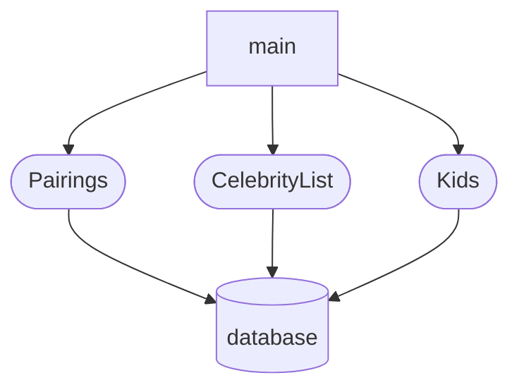
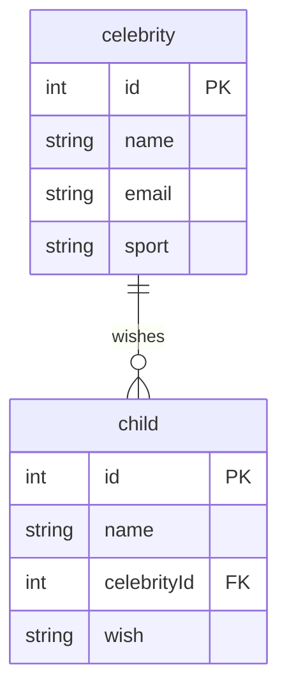

# Events and Debugging Assessment

Time to assess how well you have learned to use the debugging tools in Chrome Dev Tools, and writing click event listeners. This application is to show kids with illnesses and the memories the would like to make. Celebrities sign up to help kids make memories.

> 🧨 Make sure you answer the vocabulary and understanding questions at the end of this document before notifying your coaches that you are done with the project

## Event Listeners to Create

1. When the kid name is clicked, it should display their wish.
1. When the celebrity name is clicked, it should display their sport.
1. The pairings list should should contain the pairing in the following format.
    ```html
    {child name} will be making memories with {celebrity name}, a {celebrity sport} star, by {child wish}
    ```

Below is an animation showing how the application should look when complete and how the event listeners should work.


## Setup

Your instruction team will provide a link for you to create your assessment repository. Once your repo is created, clone it to your machine.

1. Make sure you are in your `workspace` directory.
1. `git clone {github repo SSH string}`.
1. `cd` into the directory it creates.
1. `code .` to open the project code.
1. Use the `serve` command to start the web server.
1. Open the URL provided in Chrome.

Make sure your Developer Tools are open at all times while working on this project. Use the messages provided in the Console to determine what code needs to be fixed or implemented, and use breakpoints in the Sources tab to step through your code as you debug.

## Vocabulary and Understanding

Before you click the "Complete Assessment" button on the Learning Platform, add your answers below each question and make a commit.

1. When a child is clicked on in the browser, which module contains the code that will execute on that event happening? Can you explain the algorithm of that logic?
   > The code for clicking on a child is in the Kids.js module. The code creates an event listener that defines a function which gets invoked every time the user clicks on the DOM. The function checks the metadata of the clicked item to make sure it's type is "child" and then assigns the innerText and data-wish values to variables. Those variables are then used in a string literal for an alert window to display that info to the user.
2. In the **Pairings** module, why must the `findCelebrityMatch()` function be invoked inside the `for..of` loop that iterates the kids array?
   > Because each child object has a foreign key for the celebrity that is matched with them. The findCelebrityMatch function uses that foreign key to find and return the corresponding celebrity object with the matching primary key. The function is needed to get the celebrity's name and sport, and it needs to be inside the for loop because it needs to be called for each child.
3. In the **CelebrityList** module, can you describe how the name of the sport that the celebrity plays can be displayed in the window alert text?
   > The celebrity's sport is being stored in state data on the celebrity list item in the DOM. The click event function then accesses that data through the dataset property and uses it in a string literal for the alert window's string value.
4. Can you describe, in detail, the algorithm that is in the `main` module?
   > The main module imports the Pairings, Celebrities, and Kids functions from the other modules. It then gets the container element from the DOM and assignes it to the mainContainer variable. Next it declares a string for the HTML code and invokes the three functions to create html lists inside the string. Finally the string is used to overwrite the innerHTML property of the previously found container element.

## Dependency Graph


## Entity Relationship Diagram


